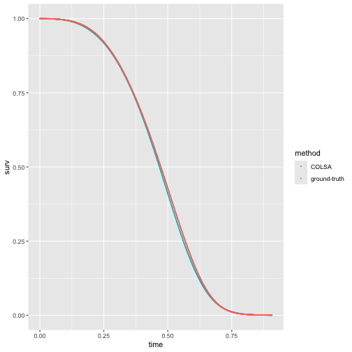

COLSA package
==========
### A package for Privacy enhanced collaborative inference in the Cox proportional hazards model for distributed data
#### Mengtong Hu

#### 2024-06-19


This is a tutorial for using the COLSA package designed for analyzing distributed survival data.

# Install Pacakges

```r
devtools::install_github("https://github.com/CollaborativeInference/COLSA") 
#> ℹ Loading colsa
library(survival)
```
# simulmixweibull() : simulate datasets
In the simulation, we considered $2$ continuous covariates and $2$ categorical covaraites. The continuous covariates are generated from a bivariate normal distribution. The first categorical covariate is generated from a Bernoulli distribution and the second categorical with $4$ classes is generated from a multinomial distribution with probabilities depending on the two levels of the first categorical covariate. The event times are generated from a mixture of Weibull distributions with shape parameters $3$ and $5$ and scale parameters $10$ and $20$. The censoring times are generated from an exponential distribution with rate $3$. The event times are right-censored at the censoring times. The true regression coefficients are $\begin{bmatrix} 0.15 & -0.15 & 0.3 & 0.3 & 0.3 & 0.3 \end{bmatrix}$. We aimed to generate $6$ datasets with $1500$ observations in the first $3$ datasets and $500$ observations in the last $3$ datasets. We then randomly split the generated data into the $6$ corresponding datasets. 

```r
ns = c(1500,1500,1500,500,500,500)
K = length(ns)
data = simulmixweibull(N = sum(ns),lambdas =  c(10, 20), gammas =  c(3,5),beta=c(0.15,-0.15,0.3,0.3,0.3,0.3), rateC=3)
```
Randomly split the generated data into 6 datasets.

```r
group_indicator = c()
for(k in c(1:(K))){
    group_indicator= c(group_indicator,rep(k,ns[k]))
  }
# The CoxPH regression formula  
form =as.formula(paste("Surv(time, status)", paste(names(data)[4:length(names(data))],collapse="+"), sep = " ~ "))
data$group = group_indicator
data$order = data$group
```
# A quick demo using updateCOLSA.demo on the generated data
Approximate the log baseline hazards using $4$th order Bernstein polynomial. Find initial estimates for gamma and beta using the first dataset.

```r
data_first = subset(data,order==1)
dg = 4
boundaryknots = c(0,max(data$time))
initial_val = find_inits(dg,data_first,form,boundaryknots)
```
Obtain the COLSA estimate using the example data.

```r
res = updateCOLSA.demo(K,data,initial_val,6+dg+1,6,boundaryknots)
```

# Applying updateCOLSA on the distributed data
In a real-world application, each hospital(analysis center) only needs to store their data in their local facility. To mimic the set-up, we saved each data set into separate folders. 

```r
tempdatadir = getwd()
save_data(tempdatadir,6)
```
Load the subdata from site 1.  We wil use the same `find_inits` function to find initial values and we initialize the Hessian Matrix to be all zeros (NA). We also set the negative log likelihood to be zero.

```r
b = 1
load(paste(tempdatadir,"/Simdata/hospital",b,"/Simdata.RData",sep=""))
dg = 4
boundaryknots = c(0,max(data$time))
initial_val = find_inits(dg,subdata,form,boundaryknots)
res = updateCOLSA.outloop(subdata,list(betahat=initial_val,Hessian = NA,negl= 0),6+dg+1,6,boundaryknots)
res_site1 = res$result
summary_stat_site1 = res$statistics
print(summary_stat_site1)
#> $betahat
#>             [,1]
#>  [1,] -5.1575349
#>  [2,]  4.5811296
#>  [3,] -2.2486353
#>  [4,]  7.1200659
#>  [5,]  1.9857759
#>  [6,]  0.1360758
#>  [7,] -0.1784957
#>  [8,]  0.2389373
#>  [9,]  0.2017259
#> [10,]  0.1756511
#> [11,]  0.3145841
#> 
#> $Hessian
#>             [,1]       [,2]       [,3]       [,4]       [,5]        [,6]       [,7]       [,8]       [,9]
#>  [1,]  27.443301  32.398088  20.113526   7.304697   1.274397   466.36937   437.6364   75.24409  15.281941
#>  [2,]  32.398088  53.636070  43.828181  20.390359   4.479376   784.60058   764.7681  131.23476  27.034416
#>  [3,]  20.113526  43.828181  45.878309  26.876255   7.380827   692.49380   710.1362  121.36685  25.341054
#>  [4,]   7.304697  20.390359  26.876255  19.682205   6.888291   357.86162   396.6162   67.62218  13.844259
#>  [5,]   1.274397   4.479376   7.380827   6.888291   3.492314    84.76067   111.4135   19.53232   3.498332
#>  [6,] 466.369373 784.600581 692.493796 357.861616  84.760671 16666.93761 13316.5834 1986.56934 431.889269
#>  [7,] 437.636415 764.768132 710.136174 396.616242 111.413542 13316.58341 12925.5060 2026.89368 421.980462
#>  [8,]  75.244087 131.234760 121.366850  67.622175  19.532319  1986.56934  2026.8937  415.00019  74.348580
#>  [9,]  15.281941  27.034416  25.341054  13.844259   3.498332   431.88927   421.9805   74.34858  85.000002
#> [10,]  29.182630  51.683733  48.603164  27.630619   7.899867   871.16546   862.1374  134.56666   0.000000
#> [11,]  35.952531  61.327087  55.323549  29.659496   7.737343   891.64140   895.0975  170.57791   0.000000
#>            [,10]      [,11]
#>  [1,]  29.182630  35.952531
#>  [2,]  51.683733  61.327087
#>  [3,]  48.603164  55.323549
#>  [4,]  27.630619  29.659496
#>  [5,]   7.899867   7.737343
#>  [6,] 871.165458 891.641398
#>  [7,] 862.137438 895.097473
#>  [8,] 134.566657 170.577907
#>  [9,]   0.000000   0.000000
#> [10,] 165.000013   0.000000
#> [11,]   0.000000 190.000006
#> 
#> $negl
#> [1] -158.3702
```
Once site 1 finishes analysis,the summary statistics `summary_stat_site1` will be passed on to Site 2. Site 2 has the turn the update the results.


```r
b = 2
load(paste(tempdatadir,"/Simdata/hospital",b,"/Simdata.RData",sep=""))
summary_stat_site2 = updateCOLSA.outloop(subdata,summary_stat_site1,6+dg+1,6,boundaryknots)$statistics
```
The process goes on till the $6$th site.


```r
b = 3
load(paste(tempdatadir,"/Simdata/hospital",b,"/Simdata.RData",sep=""))
summary_stat_site3 = updateCOLSA.outloop(subdata,summary_stat_site2,6+dg+1,6,boundaryknots)$statistics
b = 4
load(paste(tempdatadir,"/Simdata/hospital",b,"/Simdata.RData",sep=""))
summary_stat_site4 = updateCOLSA.outloop(subdata,summary_stat_site3,6+dg+1,6,boundaryknots)$statistics
b = 5
load(paste(tempdatadir,"/Simdata/hospital",b,"/Simdata.RData",sep=""))
summary_stat_site5 = updateCOLSA.outloop(subdata,summary_stat_site4,6+dg+1,6,boundaryknots)$statistics
b = 6
load(paste(tempdatadir,"/Simdata/hospital",b,"/Simdata.RData",sep=""))
res6 = updateCOLSA.outloop(subdata,summary_stat_site5,6+dg+1,6,boundaryknots)
print(res6$result)
#>        Estimates Std.Errors     p-values neg-logll
#>  [1,] -4.9623940 0.35481606 1.902679e-44 -568.2485
#>  [2,]  3.5537224 0.68174568 1.861314e-07 -568.2485
#>  [3,] -1.6719024 1.04941475 1.111207e-01 -568.2485
#>  [4,]  5.7286786 1.26457306 5.894778e-06 -568.2485
#>  [5,]  2.3404159 1.23779177 5.865113e-02 -568.2485
#>  [6,]  0.1306410 0.01009059 2.449230e-38 -568.2485
#>  [7,] -0.1230186 0.02191049 1.970211e-08 -568.2485
#>  [8,]  0.2779455 0.06148793 6.174423e-06 -568.2485
#>  [9,]  0.2793583 0.08924813 1.747285e-03 -568.2485
#> [10,]  0.2790059 0.08140947 6.098559e-04 -568.2485
#> [11,]  0.3200177 0.08013016 6.504376e-05 -568.2485
```
# Plot the estimated survival curve.
Once we obtained the COLSA estimate, we can construct the survival curves for any covariates values. Here we plot the baseline survival curve and compare it with the true baseline survival curves.


```r
library(ggplot2)
t_plot = seq(0,max(data$time[data$status==1]),0.001)
lambda =  c(10, 20); gamma =  c(3,5)
true_surv = 0.5*exp(-lambda[1]*t_plot^(gamma[1]))+  (1-0.5)*exp(-lambda[2]*t_plot^(gamma[2]))
colsa_surv = get_est_surv(res6$result[,1],t_plot,matrix(0,1,6),boundaryknots)
true_surv_df = data.frame(time =t_plot, surv = true_surv,method = "ground-truth")
colsa_surv_df =  data.frame(time = t_plot, surv = colsa_surv ,method = "COLSA")
ggplot(NULL, aes(time,surv,method)) +
    geom_point(data=true_surv_df,aes(color=method),size=0.1)+
    geom_point(data=colsa_surv_df,aes(color = method),size=0.1)
```


